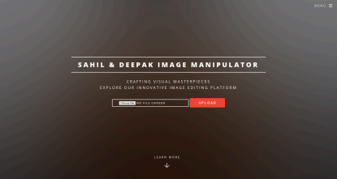
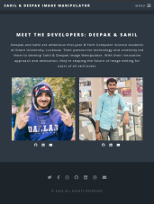

# 🖼️ Sahil & Deepak Image Manipulator

An intuitive and user-friendly online image editing tool developed by **Deepak** and **Sahil**, built using **Python**, **Flask**, and **Pillow**. This web-based application allows users to apply a variety of image transformations and filters with ease.

---

## 📌 Introduction

The **Sahil & Deepak Image Manipulator** is an online tool that allows users to upload, edit, and download images with a variety of effects, including:

- Color enhancement
- Brightness and contrast adjustment
- Multiple filters like blur, grayscale, detail, etc.
- Image transformations (crop, rotate, resize)

---

## 💻 Technologies Used

- **Python** – Core language for backend processing
- **Flask** – Lightweight framework for web application
- **Pillow** – Python Imaging Library for manipulating images
- **JavaScript** – For sliders and crop area selectors
- **HTML/CSS/JS** – For frontend design and interactivity
- **Templates** – Modified ready-made templates for the UI

---

## ✨ Features

### 🎛️ Adjustments
(Implemented using `ImageEnhance`)
- **Color** – Modify image saturation
- **Brightness** – Lighten or darken the image
- **Contrast** – Increase or decrease contrast
- **Sharpness** – Sharpen or soften the image

### 🎨 Filters
(Implemented using `ImageFilter`)
- **Blur**, **BoxBlur(1)**, **Gaussian Blur**
- **Grayscale** – Convert to shades of grey
- **Black & White** – B&W conversion using pixel threshold
- **Detail**, **UnsharpMask**

### 🔧 Transformations
- **Crop** – Area selector with cropping
- **Rotate** – Rotate by user-specified angle
- **Resize** – Set custom width & height

### ⬇️ Other Utilities
- **Reset to Original** – Undo all changes at once
- **Download** – Save the final image locally

---

## 🧠 Implementation Overview

- Image is uploaded and saved in the `static/` folder
- A copy of the image is made for all transformations
- User input (filters, adjustments) is sent to the backend
- The backend processes the image using Pillow
- The modified image is rendered back for the user

---

## 🖥️ User Interface

- **Home Page**:
  - Built using a ready-made responsive template (edited by both)
  - Includes image upload, website details, and contact info

- **Editor Page**:
  - Fully custom-built by Sahil
  - Contains sliders, selectors, and image display for real-time editing

---
## 🖼️ Demo (Screenshots)

- **🏠 Home Page**  
  
    
- **📤 Image Upload Page**  
   
- **🎛️ Adjustment Controls**  
  
- **🎨 Filters in Action** 
  
  

## 🚀 Deployment

- 🌍 [Live App on Render](https://sahil-and-deepak-image-manipulator.onrender.com)

---

## 🤝 Contributions

| Task | Deepak | Sahil |
|------|--------|-------|
| Flask backend development | ✅ | |
| Frontend design (HTML/CSS/JS) | | ✅ |
| Image processing with Pillow | ✅ | ✅ |
| Crop area & slider functionality | ✅ | ✅ |
| Homepage template editing | ✅ | ✅ |
| Meet the Developers section | ✅ | ✅ |
| Code structuring & cleanup | ✅ | |
| Error fixing & deployment | ✅ | ✅ |

---

## ✅ Conclusion

> *"Working on this project has not only strengthened our technical abilities but also taught us invaluable lessons in collaboration, testing, and clear communication. We're proud of the Sahil & Deepak Image Manipulator and look forward to building more amazing projects together!"*

---

## 📚 References

- Assistance from **ChatGPT**, **Gemini**, and **Copilot** (especially for frontend JS work)
- Used a ready-made homepage template for a more attractive UI

---

## 📎 Appendices

- 🌐 [Live Application](https://sahil-and-deepak-image-manipulator.onrender.com)

---

> *Made with 💖 by Deepak & Sahil*
